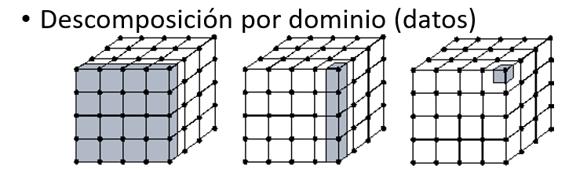
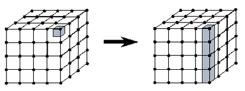
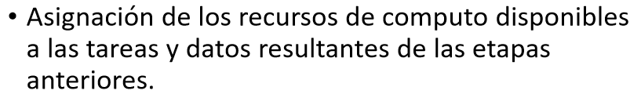

# Particionado
Para diseñar la solución en paralelo se determinó que la mejor alternativa era realizar una descomposición de los datos, es decir, cada procesador se encarga de realizar las diferentes tareas del algoritmo sobre diferentes secuencias de datos. De está manera se reduce el tiempo de ejecución ya que se realizan transcripciones en simunltaneo y no requieren esperar a que se finalice una para iniciar la otra.

# Comunicaciones
Para las comunicaciones entre procesos usamos una memoria compartida, ya que en el cluster todos los datasets se encuentran almacenados en un mismo fichero, el espacio de direccionamiento es unico y todos los processo pueden acceder a estos archivos. Al trabajar con secuencias de 10,000,000 de caracteres (para la prueba, sin embargo pueden ser mayores) se considero que esta seria la mejor opción.

# Aglomeración
Al cada procesador realizar la transcripción de cada una de las secuencias se aglomeran las lineas que componen los archivos de las secuencias de ADN. Esto con el fin de reducir el numero de comunicaciones necesarias.

# Mapeo

Para la solución en paralelo se mapean los datos a procesar, con el procesador asignado. Como un ejemplo clave de esto, es que para poder procesar 5 secuencias es necesario asignar 5 procesadores, si solo se asignan 4 procesadores no se hará la transcripción de una de las cadenas de ADN.

### Nota
Imagenes extraidas de: 02-HPC-DisenoAlgParalelos-2020-1.pdf, Diseño de Algoritmos Paralelos. Edwin Montoya - emontoya@eafit.edu.co, Alvaro Ospina - aeospina@eafit.edu.co. 2020 Universidad EAFIT
