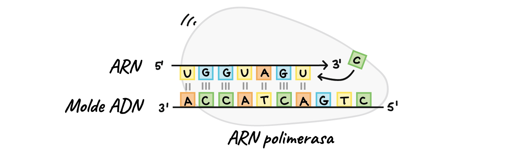

# Universidad EAFIT
# Curso ST0263 Tópicos Especiales en Telemática, 2020-1
# Estudiante: Juan Diego Saldarriaga - jsalda23@eafit.edu.co
# Trabajo 4 - HPC
### Trabajo individual

# Transcripción ADN a ARN
## 1. Caso de estudio a resolver

Durante le ejecución de este proyecto vamos a resolver el problema descrito en la página: http://rosalind.info/problems/rna/

Este problema consiste en realizar la transcripción de ADN a ARN. Está transcripción es el primer paso de la expresión genética (Proceso por el cual se codifican los ácidos nucleicos en proteínas). Este proceso consta de 3 etapas:
* Iniciación: La ARN polimerasa se une a una secuencia de ADN que se encuentra al inicio del un gen. Una vez unida, la ARN polimerasa separa las cadenas de ADN para proporcionar el molde de cadena sencilla necesario para la transcripción. [2]
* Elongación: El transcrito de ARN tiene la misma información que la cadena de ADN, pero contraria al molde en el gen. Sin embargo, a diferencia de la cadena ADN contiene la base uracilo (U) en lugar de timina (T). [2]
* Terminación: Una vez transcritas, estas secuencias provocan que el transcrito sea liberado de la ARN polimerasa. [2]
Una cadena ADN está compuesta por adenina (A), citosina (C), guanina (G) y timina (T), por lo tanto, para su fácil manejo y comprensión, se trabaja con sus siglas A, C, G y T. La cadena ARN a diferencia de la ADN está compuesta por A, C, G y uracilo (U). Sin embargo, cuando se pasa de ADN a ARN la T cambia por A, la A cambia por U, la C cambia por G, y la G cambia por C, así como se evidencia en la siguiente imagen:

<h20> Imagen e información extraída de: https://es.khanacademy.org/science/biology/gene-expression-central-dogma/transcription-of-dna-into-rna/a/overview-of-transcription </h20>

## 2. Solución Serial
La solución serial se encuentra en el archivo Scripts, bajo el nombre "Trans_ADN-RNA_SL-Secuencial". Consiste en una solución simple, donde se inicia con la lectura de todos los ficheros de texto (los cuales contienen las secuencias de ADN) y posteriormente su conversión. Para está solución simple el programa coge los archivos de texto, uno por uno, linea por linea y realiza la transcripción.

Esta soluición se ejecuta con el comando:

_python3 Trans_ADN-RNA_SL-Secuencial.py_

## 3. Solución Paralela
Para la solución serial se decidió usuar la libreria mpi4py (https://mpi4py.readthedocs.io/en/stable/index.html) la cual nos permite hacer uso de multiples procesadores, ademas de ser adecuado para trabajar con memoria compartida

